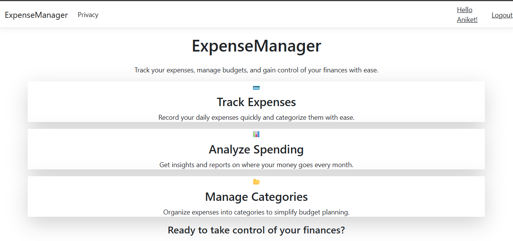
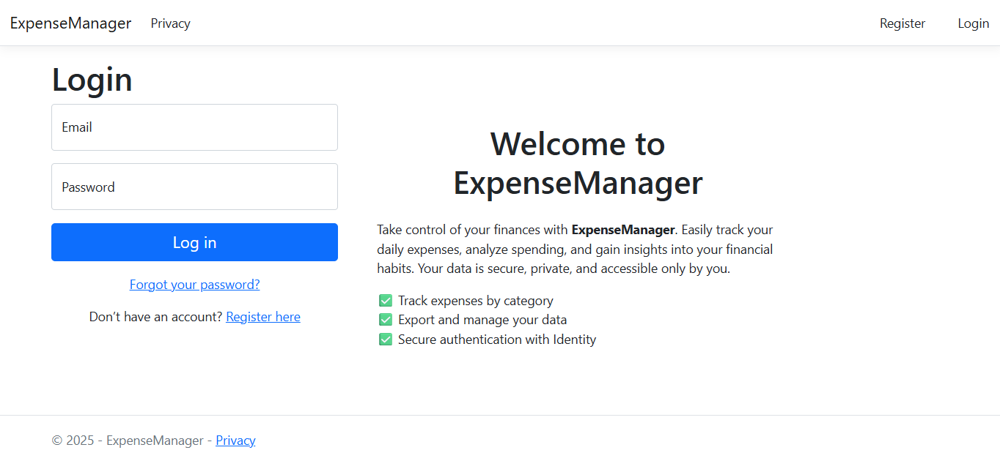
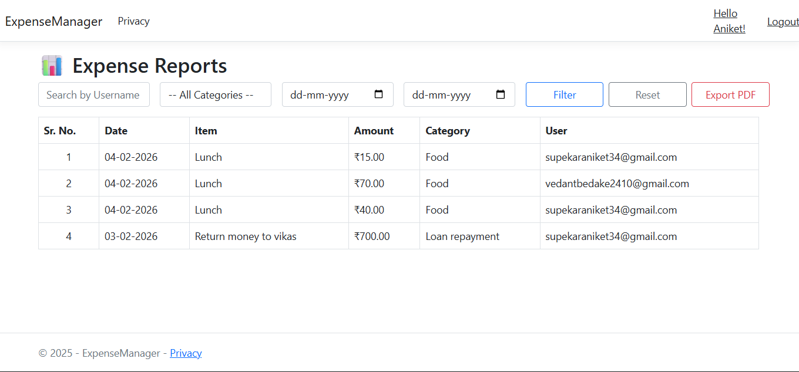

# Expense Manager (ASP.NET Core)

## Overview
Expense Manager is a full-stack web application designed to help users track and manage personal or business expenses efficiently. It provides secure authentication, structured expense tracking, and administrative control over user data.

## Features
- User registration and login using ASP.NET Identity  
- Role-based authentication and authorization  
- Add, edit, and delete expenses  
- Categorize expenses for better organization  
- Admin dashboard to manage users and monitor activity  
- Category-wise expense tracking and reporting  
- Responsive UI for desktop and mobile devices  

## Tech Stack
- ASP.NET Core MVC  
- Entity Framework Core  
- SQL Server  
- C#  
- Bootstrap  
- HTML, CSS, JavaScript  

## Screenshots

### Home Page

### Login Page

### Admin Dashboard

### User Dashboard

### Expense Report

## How to Run

1. Clone the repository  
   git clone https://github.com/supekar-aniket/Expense-Manager.git

2. Open the project in Visual Studio  

3. Update the connection string in appsettings.json  

4. Apply migrations (if required)  
   update-database

5. Run the application  

## Key Concepts Used
- MVC Architecture  
- Authentication & Authorization (ASP.NET Identity)  
- CRUD Operations  
- Entity Framework Core ORM  
- Database Design & Normalization  

## Future Improvements
- Add data visualization (charts for expense analysis)  
- Export reports (PDF/Excel)  
- API integration for mobile support  

## Author
Aniket Supekar  
GitHub: https://github.com/supekar-aniket
